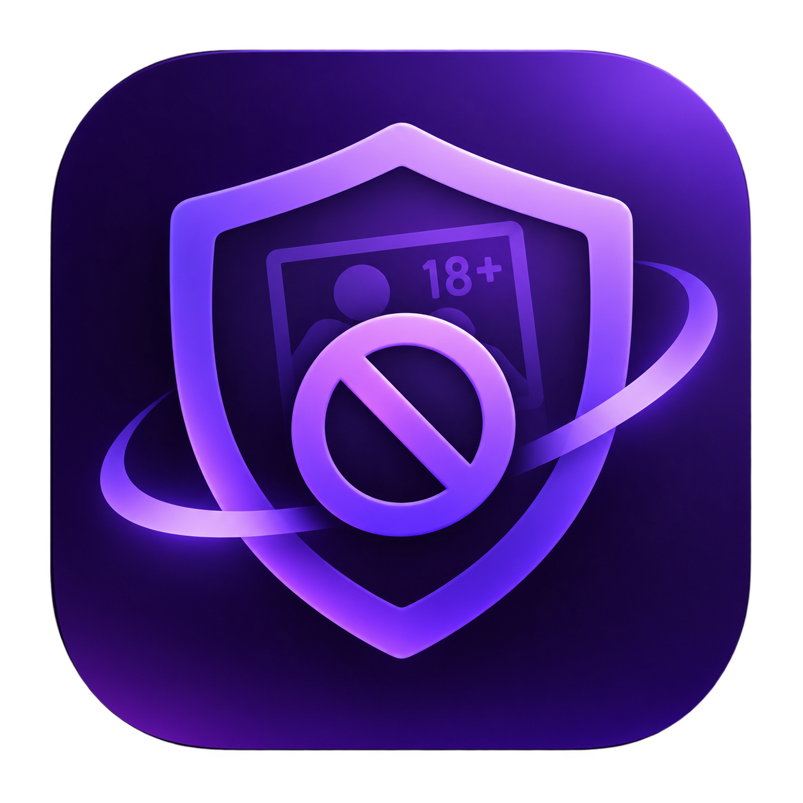
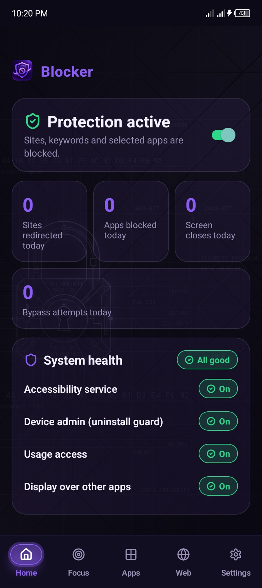
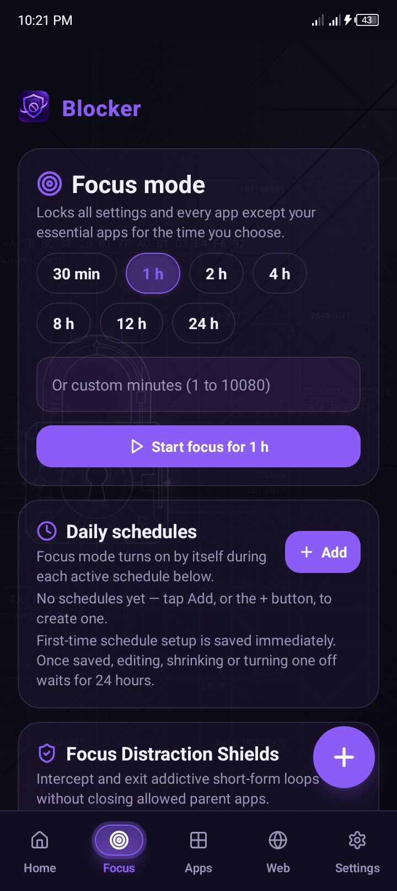
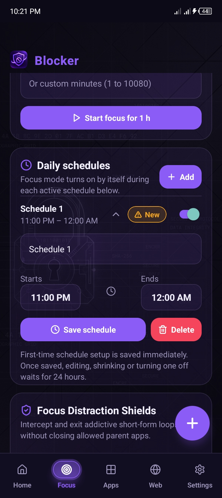
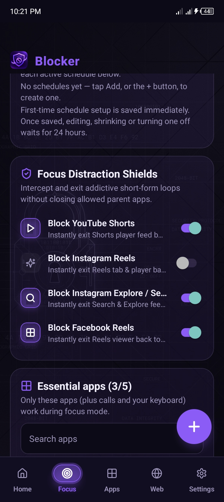
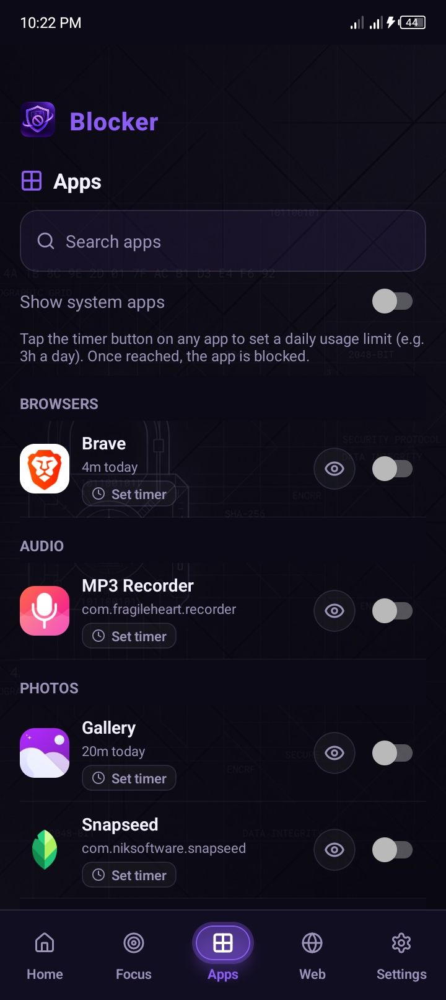
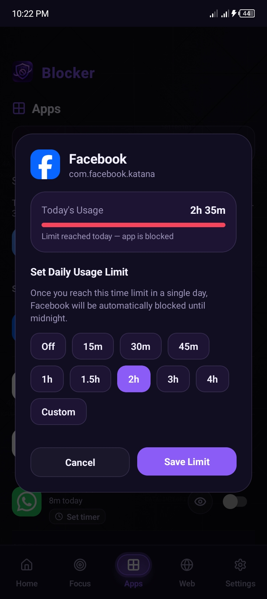
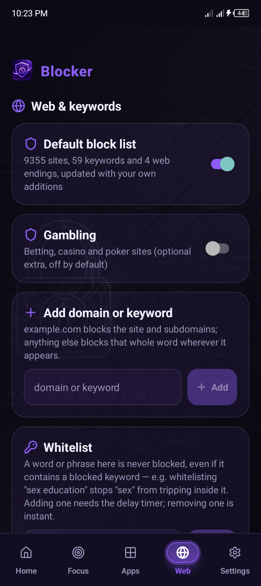
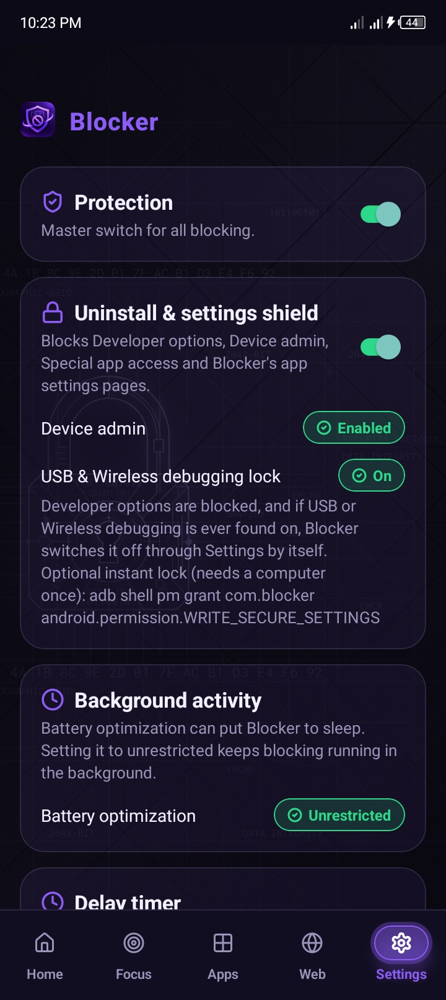
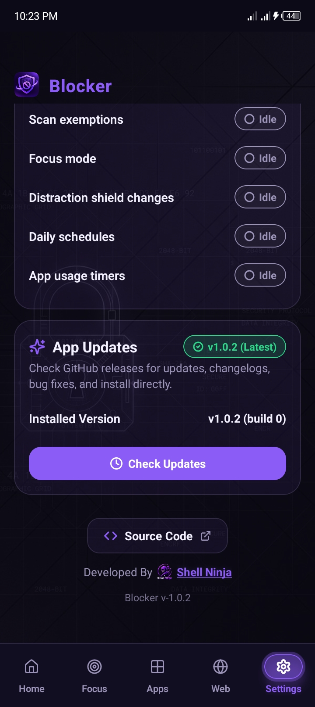

<p align="center">
  
</p>

# Blocker `v1.0.3`

> **Current Version:** `v1.0.3` | **Platform:** Android 8.0+ (API 26+) | **License:** Open Source

A privacy-focused, zero-telemetry Android distraction and content blocker built with React Native and native Android Accessibility Services.

> [!IMPORTANT]
> **Recommendation: Install the Debug Version First!**  
> We strongly recommend installing and testing the **Debug version** (`Blocker-release-debug-{VERSION}.apk`) before installing the Release build.  
> - **Test with 1-Minute Timers:** The Debug build uses short **1-minute** unlock delay timers, allowing you to freely explore, configure your custom blocklists, test focus schedules, and adjust settings without risk of accidentally locking yourself out.  
> - **Upgrade When Ready:** Once you have thoroughly tested the app and confirmed everything suits your exact needs, proceed to install the **Release version** (`Blocker-release-{VERSION}.apk`), which enforces real **1 to 30 day** delayed-unlock timers with strict anti-tamper security and no backdoors.

---

Blocker runs entirely on-device: no remote DNS, no tracking servers, no telemetry, and no account required. It blocks distracting websites, full-screen short-form video players (YouTube Shorts, Instagram Reels, Facebook Reels), and adult domains across browsers and apps.

---

## 🌟 Key Features in v1.0.2

- **In-App GitHub Release Updater:** Checks for new GitHub releases automatically every 24 hours (or on-demand in Settings). Download, inspect release notes, and install APK updates directly within the app.
- **Automatic APK Cache Cleanup:** Automatically purges downloaded update APK files as soon as the updated version is installed and running, keeping your phone's storage clean.
- **Per-App Usage Timers:** Set daily usage limits for specific apps. Once the timer expires, the app is blocked for the rest of the day.
- **Anti-Tamper & Wireless Debugging Lockdown:** Blocks Developer options, Device admin settings, and app management. Automatically switches off USB and Wireless debugging if enabled.
- **Islamic Reminder Overlays:** Replaces blocked content with thoughtful Islamic reminders, Quranic reflections, and motivational quotes.
- **Granular Distraction Shield:** Independent switches to block YouTube Shorts, Instagram Reels, and Facebook Reels without disabling the host apps.
- **⏳ Delayed Unlock Timers:** Any attempt to weaken protections, unblock apps, or shorten timers requires waiting out a delay of 24 hours to 30 days.

---

## Screenshots

<table>
  <tr>
    <td align="center" width="33%">
      <br/>
      <b>Home</b><br/>
      <sub>Live blocking stats, master toggle, and permission health check.</sub>
    </td>
    <td align="center" width="33%">
      <br/>
      <b>Focus Mode</b><br/>
      <sub>Instant distraction-free sessions with preset or custom timers.</sub>
    </td>
    <td align="center" width="33%">
      <br/>
      <b>Daily Schedules</b><br/>
      <sub>Automate recurring focus blocks with precise time pickers.</sub>
    </td>
  </tr>
  <tr>
    <td align="center" width="33%">
      <br/>
      <b>Distraction Shields</b><br/>
      <sub>Exit YouTube Shorts, Instagram Reels, and Explore feeds automatically.</sub>
    </td>
    <td align="center" width="33%">
      <br/>
      <b>Apps &amp; Scans</b><br/>
      <sub>Block installed apps outright or exempt safe apps from screen scanning.</sub>
    </td>
    <td align="center" width="33%">
      <br/>
      <b>Usage Limits</b><br/>
      <sub>Enforce maximum daily screen time per app protected by delay locks.</sub>
    </td>
  </tr>
  <tr>
    <td align="center" width="33%">
      <br/>
      <b>Web &amp; Keywords</b><br/>
      <sub>Adult domain database, custom domain blocklist, and keyword whitelisting.</sub>
    </td>
    <td align="center" width="33%">
      <br/>
      <b>Settings &amp; Shield</b><br/>
      <sub>Uninstall shield, wireless debugging locks, and 1–30 day delay timers.</sub>
    </td>
    <td align="center" width="33%">
      <br/>
      <b>In-App Updater</b><br/>
      <sub>Check GitHub releases, view changelogs, and install APK updates directly.</sub>
    </td>
  </tr>
</table>

---

## Architecture Overview

```
Blocker/
├── source/                  # Source files (working directory)
│   ├── App.tsx              # Main entry point and bottom tab navigation
│   ├── android/             # Native Kotlin code
│   │   ├── AccessibilityService.kt   # System-wide window tracker & content interceptor
│   │   ├── BlockerNativeModule.kt    # React Native bridge, delay locks & APK updater
│   │   ├── DeviceAdmin.kt            # Device Administrator receiver
│   ├── src/                 # React Native UI & Business logic
│   │   ├── screens/         # Screens (HomeScreen, AppBlockerScreen, BlocklistScreen, FocusScreen, SettingsScreen, UpdateModal)
│   │   ├── services/        # State management (ProtectionManager, BlocklistEngine, UpdateService)
│   │   ├── hooks/           # Reactive hooks (useProtection, useAppUpdate)
│   │   ├── native/          # TypeScript bridge definitions (BlockerNative)
│   │   └── data/            # Static data (appVersion, categories, userLists)
├── blocklists/              # Blocklist source files
│   ├── block-list.md        # Obfuscated adult domain, keyword, and TLD database
│   ├── my_list.txt          # Plaintext user additions (1 per line)
│   └── whitelist.txt        # Plaintext whitelist entries (1 per line)
├── assets/                  # App icon source artwork (app-icon-source.png)
├── build_apk.sh             # Main automated build script
├── 05_install_on_phone.sh   # ADB install script for connected device
├── import_lists.py          # Blocklist parser & userLists generator
├── patch_android.py         # Copies source into React Native project and patches Android files
├── set_version.py           # Auto-increments version and build numbers
└── env.sh                   # Environment variables (Android SDK, Java paths)
```

---

## Prerequisites & Required Packages

Building Blocker requires:

1. **Operating System:** Linux (Arch Linux recommended; Debian/Ubuntu supported with equivalent packages)
2. **Java Development Kit:** JDK 17 (OpenJDK 17)
3. **Node.js:** Node.js LTS (v18 or v20) and `npm`
4. **Android SDK & Build Tools:**
   - Android SDK Platform 34 (`platforms;android-34`)
   - Build Tools 34.0.0 (`build-tools;34.0.0`)
   - NDK 25.1.8937393 (`ndk;25.1.8937393`)
   - CMake 3.22.1 (`cmake;3.22.1`)
   - Android Command-Line Tools (`cmdline-tools;latest`)
   - Android Platform Tools (`adb`)
5. **Python:** Python 3.8+ with standard library (used by build helper scripts)
6. **System Utilities:** `git`, `unzip`, `bash`

### Package Installation Commands

#### Arch Linux:
```bash
sudo pacman -S --needed jdk17-openjdk nodejs npm android-tools unzip git python
sudo archlinux-java set java-17-openjdk
```

#### Ubuntu / Debian:
```bash
sudo apt update
sudo apt install -y openjdk-17-jdk nodejs npm adb unzip git python3
sudo update-alternatives --set java /usr/lib/jvm/java-17-openjdk-amd64/bin/java
```

---

## Building the APK

The primary build pipeline is controlled by `build_apk.sh`.

### 1. Configure Environment (`env.sh`)

Ensure `env.sh` points to your installed Android SDK and Java 17 locations:

```bash
export JAVA_HOME=/usr/lib/jvm/java-17-openjdk

HERE="$(cd "$(dirname "${BASH_SOURCE[0]}")" && pwd)"
export ANDROID_HOME="$HERE/Android/Sdk"
export ANDROID_SDK_ROOT="$ANDROID_HOME"
export PATH="$JAVA_HOME/bin:$ANDROID_HOME/cmdline-tools/latest/bin:$ANDROID_HOME/platform-tools:$PATH"
```

If you do not have the Android SDK command-line tools yet, place `commandlinetools-linux-*_latest.zip` directly in the `Blocker-App` directory (or `~/Downloads`). You can also place `android-ndk-r25b-linux.zip` and `gradle-8.3-all.zip` in `Blocker-App` to skip large downloads over the network. The build script automatically detects and sets them up.

### 2. Build Commands

#### Debug Build (Recommended First Step):
```bash
./build_apk.sh debug
```
* Uses **1-minute** delay timers for protection unlocks so you do not get locked out while testing.
* Automatically imports blocklists, increments the build number, patches React Native files, and compiles.
* Outputs the binary to: `apk/Blocker-debug-{build_number}.apk`.

#### Release Build (When Ready for Real Protection):
```bash
./build_apk.sh release
```
* Enforces real **1 to 30 day** delayed-unlock timers.
* Strict anti-tamper security: settings changes cannot be bypassed without waiting the full duration.
* Outputs the binary to: `apk/Blocker-release-{build_number}.apk`.

### 3. Install on Device

Connect your phone with **USB Debugging** enabled in Developer Options, then execute:

```bash
# First test with debug:
./05_install_on_phone.sh debug

# When satisfied, install release:
./05_install_on_phone.sh release
```

---

## How to Modify and Customize

### 1. Editing App Logic & UI
All application development takes place under the `source/` folder:
* **UI Screens:** Edit `source/src/screens/` (`HomeScreen.tsx`, `SettingsScreen.tsx`, `FocusScreen.tsx`, `UpdateModal.tsx`, etc.).
* **Component Styling:** Edit `source/src/ui.tsx` for shared components, colors, and design system.
* **Native Android Interception:** Edit `source/android/AccessibilityService.kt` to modify window state detection, URL bar checking, or anti-tamper logic.
* **Native Modules & Updater:** Edit `source/android/BlockerNativeModule.kt` to modify Kotlin methods exposed to React Native.

**Important:** Do **not** edit directly inside `project/ (or $BLOCKER_DIR)` — that directory is the build target. Always edit inside `source/`. The build script copies files from `source/` into `project/ (or $BLOCKER_DIR)` automatically during the build process.

To manually sync changes from `source/` into the build target without a full rebuild:
```bash
python3 patch_android.py ~/Blocker source
```

### 2. Adding or Modifying Blocklists
* **Custom Additions:** Open `blocklists/my_list.txt` and add one domain or keyword per line.
* **Whitelist Items:** Open `blocklists/whitelist.txt` and add entries (e.g., words like `camera` or `essex` that contain false-positive substrings).
* After updating text lists, regenerate the TypeScript database:
  ```bash
  python3 import_lists.py
  ```

### 3. Changing the App Icon
* Replace `assets/app-icon-source.png` with your desired PNG image (recommended 1024x1024).
* Regenerate all Android mipmap icon resolutions:
  ```bash
  python3 generate_icons.py
  python3 embed_icon.py
  ```

---

## Required Android Permissions

Once installed on a physical device, Blocker requires the following permissions to provide full protection:
1. **Accessibility Service:** Required to inspect active window activities, detect open URL bars in web browsers, scan text for blocked keywords, and detect short-form video players (YouTube Shorts, Reels).
2. **Display Over Other Apps (Overlay):** Used to display the non-intrusive blocked notification banner and reminder screen.
3. **Usage Access (Package Usage Stats):** Required to calculate daily per-app usage time and enforce daily app limits.
4. **Device Administrator:** Prevents immediate uninstallation while Protection Mode is active.
5. *(Optional)* **Write Secure Settings:** Allows Blocker to automatically and instantly turn off USB & Wireless debugging if enabled (`adb shell pm grant com.blocker android.permission.WRITE_SECURE_SETTINGS`).

---

## License & Credits

* **Developer:** [Shell Ninja](https://github.com/shell-ninja)
